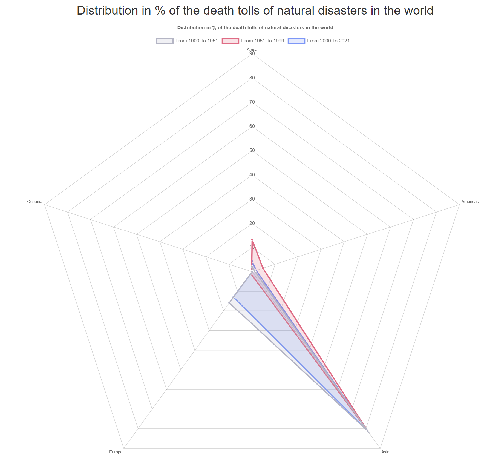
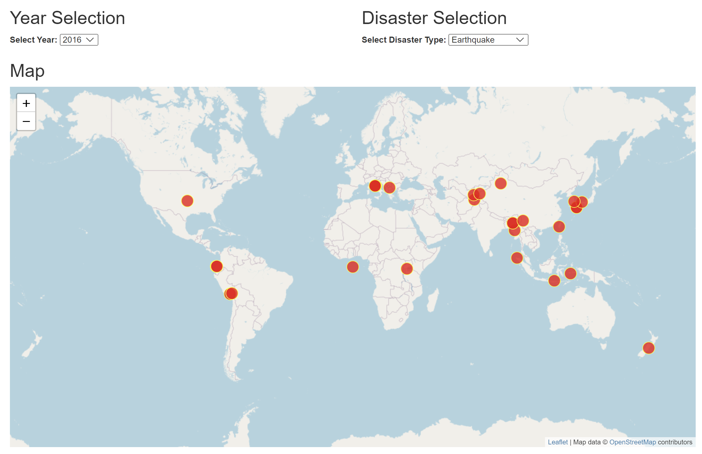
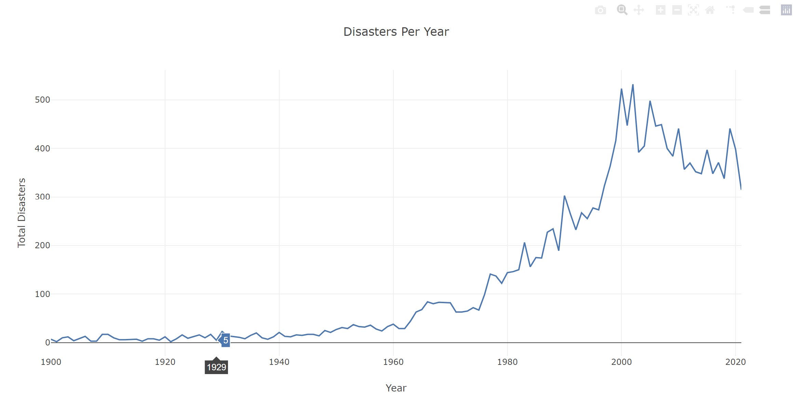
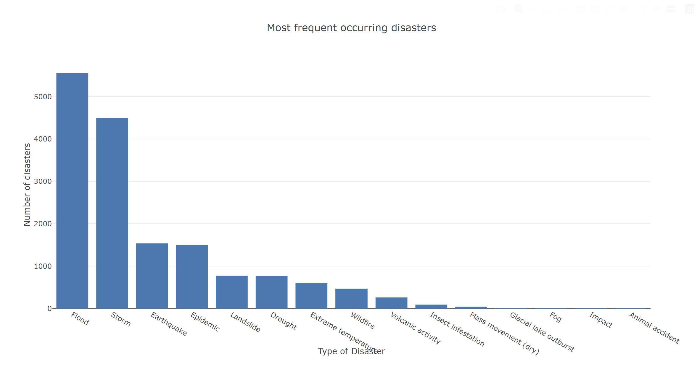
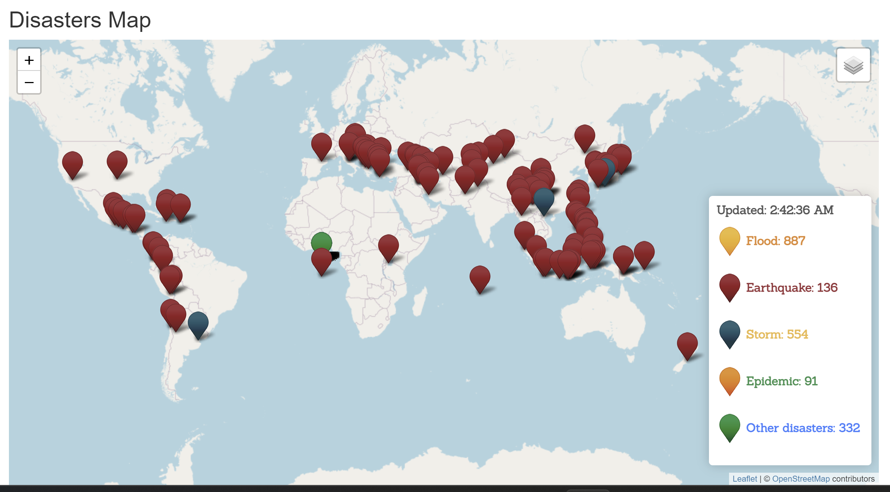

# group-project-3
### Project 3. Natural Disasters Around The World Interactive Dashboard

As we know, the global climate disaster makes its impact on us more felt day by day. Understanding the parameters created by the climate crisis will be helpful in deciding the measures we will take against it.
​
## Group Members:   
* Nifa Coutinho (ID - NifaCout)
* Khrystyna Dubei (ID - kristinadubei)
* Tran Duong (ID - TranD93)
* Makram KaraBibar (ID - makramkb)
* Elee Saleem (ID - elee-saleem)
​
## Summary
In this research, we explored and visualized data of natural disasters around the world which covered 16,000 records of data from 1900 to 2021 and analyzed how these statistics are changing, which disaster type is more impactful on humans and which country/continent has the most number of disasters.
​
## Source of Data:  
[Kaggle Natural Disasters Dataset](https://www.kaggle.com/datasets/brsdincer/all-natural-disasters-19002021-eosdis "ALL NATURAL DISASTERS 1900-2021 / EOSDIS")

We chose this dataset because it covers many aspects like disaster type, country, latitude, longitude, death toll, year, damage costs and others, which enable us to visualize and analyze trends and changes.
​
## The Collection, Exploration, and Cleanup Process:
### Backend processes:
- Created SQLite database, created SQL schema for database table setup and imported the CSV file (with natural disaster data).
- Completed data processing with Python (filters, groupby, to_json).
- Created routes for each visualization using Flask.
​
### Frontend processes:
- Made charts and map visualizations using JavaScript, after importing the data from Flask routes into JavaScript files.
- Using HTML enabled the preview of data as a webpage + CSS as code for styling.
​
## Analysis and Explanation
- 
ex. This chart illustrates how number of disasters goes up over time. It significantly goes up from 1996.
​
- 
ex. In this chart, we see the number of each disaster type. We notice that the most occurring disaster is a flood followed by a storm, while we notice that animal accidents, fog, impact, and glacial lake outbursts are the least occurring disasters.
​
- 
ex. This chart illustrates the death toll per disaster and which disaster is the most fatal than others. We notice that droughts followed by epidemics are the most fatal ones.
​
- 
ex. This chart shows countries with the number of disasters. We notice that the US followed by India, Indonesia, Bangladesh, and Iran are the most 5 countries with the number of disasters. 
​
- 
ex. This chart shows countries with the number of disasters. We notice that the US followed by India, Indonesia, Bangladesh, and Iran are the most 5 countries with the number of disasters.

## Conclusion 
In the last 20 years, disasters have not ticked up, floods and storms are the most occurring disasters in the five countries with the highest number of 
disasters (India, Indonesia, Bangladesh, and Iran). Asia is the leading continent where the deadliest natural disasters happened.

◦  **Geographical Vulnerability:** Asia's vast size and geographical diversity contribute to its susceptibility to a wide range of natural disasters, including earthquakes, tsunamis, typhoons, floods, and volcanic eruptions.
◦ **Population Density:** Asia is the most populous continent, with many densely populated urban areas. When natural disasters strike, the potential for loss of life and damage to infrastructure is higher due to the concentration of people and assets.
​
## Dataset Limitations and Potential Next Steps for The Project:
- Given dataset can be not fully reliable, particularly for years prior to 1960 - many countries were not capable to record all incidents such as floods, animal attacks, landslides, etc. Even to this day, not every incident in the world is being documented.
- The number of deaths or people affected by a disaster could be higher - the dataset is reporting only the number of people dead/affected that were documented, and many people can go missing without a trace, die at home not being able to reach a medical facility, etc. Therefore the number of deaths could be bigger in an indirect way.
- Potential next steps we could only consider the more reliable data of 1985 and after, since more countries were able to record and document the incidents.
- We could also investigate and consider deaths in the last 60 days following the disaster as indirect victims of the disasters.
